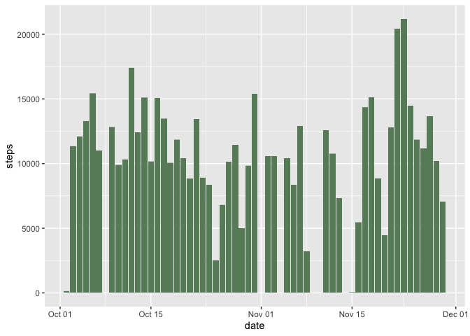
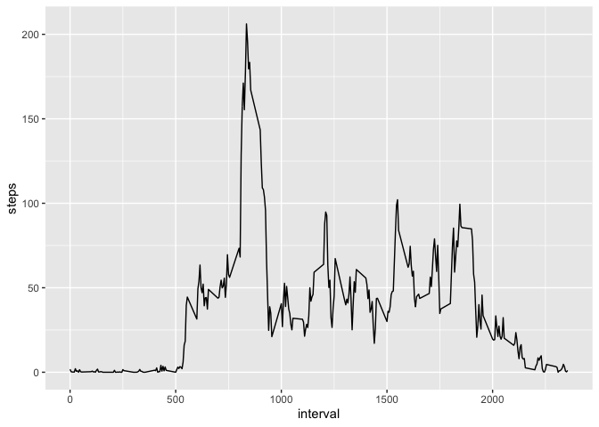
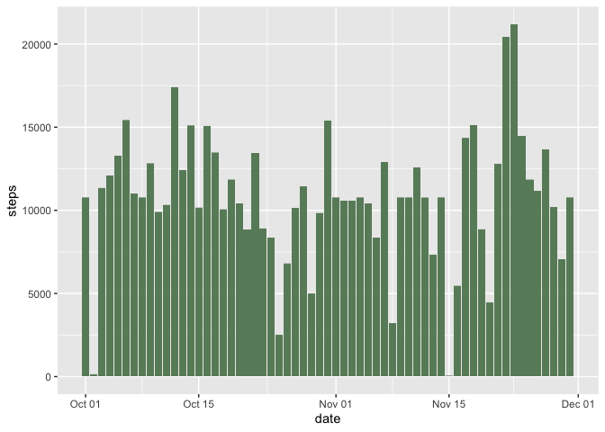
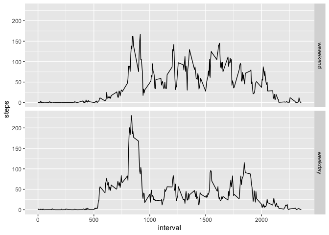

## Loading and preprocessing the data
Loading activity dataset and transforming factor variable into date format:


```r
activity <- read.csv("activity.csv")
activity$date <- as.Date(activity$date)
```

## What is mean total number of steps taken per day?
Histogram of total number of steps per each day:


```r
library(ggplot2)
```

```
## Warning: package 'ggplot2' was built under R version 3.6.2
```

```r
spd <- ggplot(activity, aes(date, steps))
spd + geom_col(fill = "darkseagreen4")
```

```
## Warning: Removed 2304 rows containing missing values (position_stack).
```

<!-- -->

Calculating mean and median:


```r
m <- mean(tapply(activity$steps, activity$date, 
                  sum, na.rm = TRUE, simplify = TRUE))
md <- median(tapply(activity$steps, activity$date, 
                    sum, na.rm = TRUE, simplify = TRUE))
```
#### Mean and median total number of steps taken per day are **9354.2295082** and **10395** respectively

## What is the average daily activity pattern?
Timeline series plot of the 5-minute interval and the average number of steps taken across all days:


```r
library(ggplot2)
ints <- tapply(activity$steps, activity$interval, 
               mean, na.rm = TRUE, simplify = TRUE)
ints2 <- unique(activity$interval)
avgs <- cbind.data.frame(ints, ints2)
colnames(avgs) <- c("steps", "interval")
timeline1 <- ggplot(avgs, aes(interval, steps))
timeline1 + geom_line()
```

<!-- -->

Getting number of 5-minute interval with maximum number of steps:


```r
maximum <- attr(ints[ints == max(ints)], which = "names")
```

#### 5-minute interval that on average across all days has maximum number of steps is interval **835**

## Imputing missing values

Calculating total number of missing values in a dataset:


```r
nas <- subset(activity, is.na(activity$steps))
totalna <- length(nas$steps)
```
#### Total number of missing values is **2304**

Creating a new dataset with missing values filled in:


```r
narows <- attr(nas, which = "row")
activity2 <- activity
for (n in narows) {
        interv <- activity[n,3]
        subs <- subset(activity, activity$interval == interv)
        mvalue <- mean(subs$steps, na.rm = TRUE)
        activity2[n,1] <- mvalue
}
```

Histogram of total number of steps per each day (missing values filled in):


```r
library(ggplot2)
spd <- ggplot(activity2, aes(date, steps))
spd + geom_col(fill = "darkseagreen4")
```

<!-- -->

Calculating mean and median (missing values filled in):


```r
mcor <- as.character(mean(tapply(activity2$steps, activity2$date, sum, na.rm = TRUE, simplify = TRUE)))
mdcor <- as.character(median(tapply(activity2$steps, activity2$date, sum, na.rm = TRUE, simplify = TRUE)))
```

Mean is 10766.1886792453 and median is 10766.1886792453

As I was fiiling in NA`s with mean values of corresponding 5-minute interval and there were whole days of missing values, so sum of steps of those days become actual mean and median among all days.

## Are there differences in activity patterns between weekdays and weekends?

Creating a new factor variable with two levels -- "weekday" and "weekend":


```r
activity2$weekdays <- weekdays(activity2$date)
activity2$weekend[activity2$weekdays == "Sunday" | activity2$weekdays == "Saturday"] <- "weekend"
activity2$weekend[activity2$weekdays == "Monday" | activity2$weekdays == "Tuesday" | activity2$weekdays == "Wednesday" | activity2$weekdays == "Thursday" | activity2$weekdays == "Friday"] <- "weekday"
```

Panel plot with a time series of the average steps taken for 5-minute intervals by weekends and weekdays.


```r
library(ggplot2)
subs <- subset(activity2, activity2$weekend == "weekend")
subs2 <- subset(activity2, activity2$weekend == "weekday")
intss1 <- tapply(subs$steps, subs$interval, mean, na.rm = TRUE, simplify = TRUE)
intss2 <- tapply(subs2$steps, subs2$interval, mean, na.rm = TRUE, simplify = TRUE)
avgs1 <- cbind.data.frame(intss1, ints2)
avgs2 <- cbind.data.frame(intss2, ints2)
colnames(avgs1) <- c("steps", "interval")
colnames(avgs2) <- c("steps", "interval")
avgs1$weekend <- "weeekend"
avgs2$weekend <- "weekday"
dataforpanel <- rbind(avgs1, avgs2)
timeline2 <- ggplot(dataforpanel, aes(interval, steps))
timeline2 <- timeline2 + geom_line()
timeline2 <- timeline2 + facet_grid(rows = vars(weekend))
timeline2
```

<!-- -->


